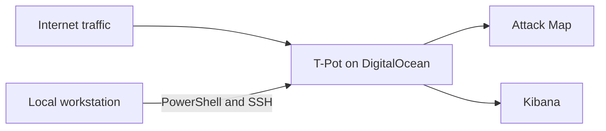

# T-Pot Honeypot Deployment and Attack Monitoring

Cloud-hosted honeypot lab built with T-Pot and DigitalOcean to observe unsolicited internet traffic, investigate attack activity, and develop hands-on experience with Kibana-based security telemetry.

## Project Overview

I deployed a publicly reachable T-Pot honeypot on a DigitalOcean droplet and administered it remotely through SSH from PowerShell. Once the system was online, I used T-Pot's Attack Map and Kibana dashboards to monitor connection attempts, review brute-force activity, and identify the services being targeted.

I had been interested in honeypots for a while and wanted to understand how they worked beyond theory. This project gave me direct experience deploying a controlled environment, observing real internet traffic, and interpreting the resulting security data.

## Objectives

- Deploy a publicly reachable T-Pot honeypot in a cloud environment.
- Administer the server remotely through SSH and PowerShell.
- Monitor incoming activity through the T-Pot web interface.
- Use Kibana to investigate brute-force attempts and targeted services.
- Build foundational experience with honeypots, attack telemetry, and event analysis.

## Lab Environment

| Component | Configuration |
|---|---|
| Cloud provider | DigitalOcean |
| Instance | 4 vCPUs, 8 GB memory, 50 GB SSD |
| Deployment | Internet-facing cloud droplet |
| Administration | PowerShell and SSH |
| Honeypot platform | T-Pot |
| Analysis tools | T-Pot Attack Map and Kibana |

## What T-Pot Is

T-Pot is an all-in-one honeypot platform that combines multiple honeypot services with monitoring and visualization tools. It collects activity directed at exposed services and makes the resulting telemetry available through dashboards and analysis interfaces.

## Architecture



## Deployment Workflow

### 1. Provisioned the cloud environment

I created a DigitalOcean droplet to host T-Pot. Making the system internet-facing allowed it to receive unsolicited scanning and connection attempts from external hosts.

### 2. Connected through SSH

I used PowerShell on my local computer to connect to the droplet over SSH. PowerShell primarily served as my interface for remote administration and installation during this lab.

### 3. Installed T-Pot

From the SSH session, I installed T-Pot using its GitHub-hosted installation files. The setup process included installing Git, cloning the T-Pot repository, running the installer, and rebooting the server after installation.

I followed this reference during the deployment: [T-Pot deployment tutorial](https://www.youtube.com/watch?v=KKu8CnTkcY0).

### 4. Created the management account

As part of the setup process, I manually created a user named `shane` for access and management.

### 5. Reconnected on T-Pot's SSH port

Following installation, the SSH service moved from port 22 to port 64295. I reconnected using:

```bash
ssh -p 64295 <public-ip>
```

### 6. Accessed the T-Pot dashboard

After installation completed, I opened the web interface at:

```text
https://<public-ip>:64297
```

The interface provided access to tools including:

- Attack Map
- CyberChef
- Elasticvue
- Kibana
- SpiderFoot

### 7. Monitored live activity

I first used the Attack Map for a high-level view of incoming traffic, then moved into Kibana to inspect individual events, attempted credentials, source IP addresses, messages, and targeted services in greater detail.

## Observations

The honeypot began receiving noticeable activity within approximately 20 minutes. Source IP geolocation data displayed traffic associated with several countries, including:

- United States
- Romania
- United Kingdom
- France

Much of the traffic appeared automated. This was consistent with broad scanning and repeated login attempts rather than a single targeted attacker. Some Kibana events contained null username or password values, while SSH brute-force events exposed the attempted credential pairs.

After leaving the honeypot online overnight, I returned the next day and observed a wider variety of activity that I could investigate in Kibana.

### Services and activity observed

- SSH brute-force attempts
- SMB-related activity
- MySQL-related activity
- SQL-related activity
- Telnet activity
- RPC activity
- HTTP activity

The speed and variety of the activity demonstrated how quickly publicly exposed infrastructure attracts opportunistic scans and automated attacks.

## Analysis Experience

The most valuable part of this project was learning how to interpret the collected telemetry after the deployment was running. I began with the high-level Attack Map and then used Kibana fields such as `username`, `password`, `message`, and `src_ip` to investigate individual events.

In SSH brute-force data, I observed attempted username and password combinations such as `validator` / `validator`. The combinations `admin123` / `1234567890` and `ubuntu` / `ubuntu` also appeared frequently during my observation period.

At the start of the project, I did not understand every installation step in depth. Working with the live environment afterward helped me connect the deployment process to the services, events, and dashboards I was analyzing.

## Evidence

### Global attack activity


The T-Pot Attack Map provided a high-level visualization of incoming activity and the geographic locations associated with observed source IP addresses.

### Kibana event analysis


In Kibana Discover, I added the `username`, `password`, `message`, and `src_ip` fields to make SSH brute-force activity easier to review. The screenshot shows an attempted `validator` / `validator` credential pair.

## Skills Demonstrated

- T-Pot honeypot deployment
- DigitalOcean cloud infrastructure
- Linux server administration
- PowerShell and SSH remote access
- Attack-surface monitoring
- Kibana event investigation
- SSH brute-force analysis
- Network-service targeting awareness
- Security telemetry interpretation

## Key Takeaways

### Internet-facing systems attract traffic quickly

The honeypot began receiving connection attempts shortly after deployment, showing how rapidly automated scanners discover exposed infrastructure.

### Much of the activity is automated

Repeated patterns and broad service probing suggested that a significant portion of the observed traffic came from bots conducting automated scans and login attempts.

### Attackers probe more than SSH

Before this lab, I primarily associated attacks against internet-facing systems with SSH brute force. The honeypot also recorded activity involving SMB, Telnet, MySQL, HTTP, RPC, and SQL-related services.

### Visualization supports investigation

The Attack Map made the overall activity easy to recognize, while Kibana provided the event-level detail needed to understand which services and credential combinations were being tested.

## Challenges and Reflection

I followed the installation tutorial closely and did not fully understand every setup step while performing it. My understanding improved significantly once the system was running and I could connect the configuration to the telemetry in T-Pot and Kibana.

This was one of the most exciting labs I had completed at the time. Seeing real systems interact with the honeypot transformed an abstract security concept into something I could deploy, monitor, and investigate myself. That initial reaction motivated me to spend more time exploring the collected events and understanding what they represented.

My immediate reaction was: *"I think this is insanely awesome. The fact that real machines are trying to attack me, and it's not a little amount of them either."* That excitement is what made the project stand out and encouraged me to explore the data more deeply.

## Future Improvements

- Run the honeypot longer to collect a larger dataset.
- Explore storing and organizing additional data through Elasticvue.
- Document recurring source IPs, ports, usernames, and attack patterns.
- Compare attack volume across different time periods.
- Add firewall controls and measure how they affect observed activity.
- Perform deeper Kibana analysis across individual honeypot services.

## Responsible Use

This repository documents a defensive cybersecurity lab deployed on infrastructure I controlled. Honeypots should be isolated, monitored, and operated in accordance with the cloud provider's terms and applicable authorization requirements.
